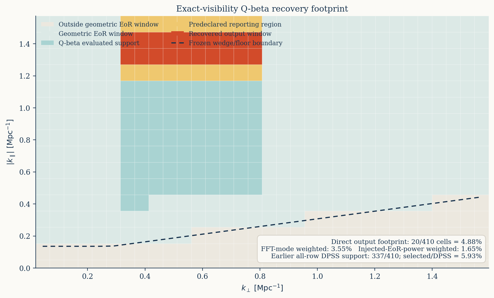
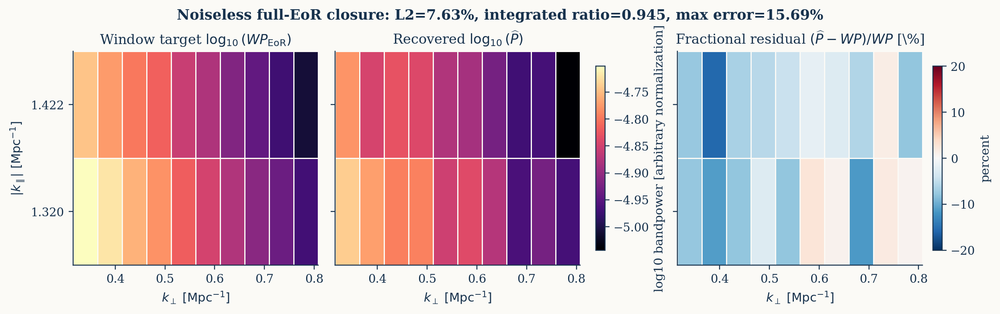
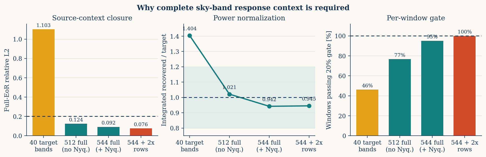

# 32 频 visibility-domain `Q_beta` 天空带功率闭合

## 1. 目的

前一轮 CHIPS/DPSS 测试已经证明：保持 baseline-time identity 时，前景在
visibility domain 仍然集中在低-delay 平滑子空间；但滤波后的 delay power
不能直接解释为未滤波天空 PS2D，因为 chromatic baseline migration 使简单
delay-diagonal window 严重失配。

本轮实现下一步：用精确 visibility operator 将每个天空圆柱功率带传播到
DPSS 滤波后的二次估计量，直接标定

```text
Q_beta = exact visibility sampling
       + channel/time averaging
       + chromatic baseline migration
       + DPSS hard projection
       + noiseless quadratic bandpower.
```

科学输出是响应标定后的 windowed sky bandpower，不是对欠定响应矩阵作逐
source-bin 强制反演。

## 2. 数据与冻结口径

- 使用 117.9--121.0 MHz 的 32 个连续频点，间隔 0.1 MHz。
- visibility bank 与前一轮 CHIPS 测试相同，SHA256 为
  `f09644cda5e22dfb5adf572ef54f1df3dd68688f8ad8f5ecfdc36772bc53a1d7`。
- analysis contract SHA256 为
  `37a984ec43857510c821de560331670d494077cea25331df3e2ba7b17176a99d`。
- 本轮仍为无噪声、无 PB、固定 baseline-time rows、无 uv gridding。
- exact operator 使用 direct DFT，并包含 OSKAR 等价的 100 kHz channel
  averaging 与 10 s time averaging。
- DPSS delay support 由视场角、冻结 wedge buffer 和每个 `k_perp` 决定；
  使用 hard projection，不扫描强度。
- reporting target 在运行前由配置固定为 10 个中间 `k_perp` bins 和 4 个
 最高 `k_parallel` 非 Nyquist source bins，共 40 bands。

## 3. `Q_beta` 构造

将 32x512x512 天空 cube 作正交 3D FFT，并按圆柱
`(k_perp, |k_parallel|)` 分带。对每个 source band `beta` 生成独立随机相位、
单位带功率的实天空 probe，经精确 operator 和同一 DPSS 二次估计器得到
`q_alpha`。校准响应为

```text
R[alpha,beta] = E_probe[q_alpha | unit power in beta].
```

对任意 source bandpower 向量 `p`，预测的滤波 observable 是 `R p`。
本轮最终 source basis 有 544 列：

- 32 个 in-range `k_perp` bins；
- 17 个 `|k_parallel|` 层；
- 显式包含 radial Nyquist 输入层。

输出只有 112 个 reporting-`k_perp` support rows，因此 `112x544` 响应必然
欠定。最终不报告 `R` 的伪逆逐 bin 解，而使用

```text
W[alpha,beta] = R[alpha,beta] / sum_beta R[alpha,beta]
P_hat[alpha]  = q_alpha / sum_beta R[alpha,beta].
```

闭合真值是 `W p`。输出窗口仅由响应选择：

1. 相对 `Q_beta` 响应不低于 0.1；
2. `W` 在预声明 40 个 reporting source bands 内的权重不低于 0.8。

该选择不读取 injected EoR realization、foreground 标签或 total-data
闭合结果。

## 4. 为什么必须包含完整 context

逐步扩展 source basis 得到：

| source response | rows/bin | selected | full-EoR L2 | integrated ratio | 20% gate |
|---|---:|---:|---:|---:|---:|
| 40 reporting bands | 192 | 52 | 1.103 | 1.404 | 24/52 |
| 512 in-range，排除 Nyquist | 192 | 30 | 0.1240 | 1.0214 | 23/30 |
| 544 in-range，包含 Nyquist | 192 | 20 | 0.09182 | 0.9421 | 19/20 |
| 544，目标区 384 rows/bin | 384 | 20 | 0.07634 | 0.9450 | 20/20 |

40 列版本自身的 restricted-EoR 与独立相位 probes 可以闭合，但 full EoR
失败；额外偏差来自未建模的 472 个 in-range EoR bands，而不是 foreground。
扩到 512 列后，剩余失败集中在最高非 Nyquist `k_parallel` 层。补入 32 个
radial-Nyquist source bands 后，full-EoR 与 restricted-EoR 几乎完全重合，
同时响应窗口自动放弃对 Nyquist context 依赖超过 20% 的最高输出层。

这说明“分析输出排除 Nyquist”不等于“operator/taper 对 Nyquist 输入无响应”。
完整 source context 是天空带功率解释成立的必要条件。

## 5. 最终无噪声结果

最终运行把固定计算预算集中到预声明 reporting `k_perp` 范围：

- 4 个不重叠 row partitions；
- 每 partition 每个 reporting `k_perp` bin 取 96 rows；
- 合计 384 rows/bin、3840 个唯一 baseline-time rows；
- 32 频共 122,880 个选中 visibilities；
- exact direct-DFT 对 OSKAR EoR visibility 的相对闭合误差为
  `3.813e-6`。

响应和窗口诊断：

- response shape `112x544`，row rank 112；
- retained condition number `148.0`；
- calibration/independent-validation response L2 `0.05278`；
- 选出 20 个窗口；
- 窗口覆盖 `k_perp` indices 6--15，即
  `0.31494--0.80790 Mpc^-1`；
- 窗口覆盖 `k_parallel` indices 13、14，即
  `1.32050`、`1.42207 Mpc^-1`；
- target-window fraction 最小/中位/最大为
  `0.8599/0.9708/0.9868`；
- window effective width 中位数为 3.851 source bands。

主闭合结果：

| 输入 | relative L2 | integrated ratio | max window error | 20% gate |
|---|---:|---:|---:|---:|
| restricted in-range EoR | 0.07681 | 0.94459 | 0.15713 | 20/20 |
| full bank EoR | 0.07634 | 0.94503 | 0.15689 | 20/20 |
| full FG+EoR | 0.07634 | 0.94504 | 0.15689 | 20/20 |
| held-out phase mixture 1 | 0.05278 | 1.00153 | 0.11718 | 20/20 |
| held-out phase mixture 2 | 0.05496 | 1.01419 | 0.20132 | 19/20 |

foreground-to-target integrated absolute ratio 为 `2.074e-6`。full EoR 与
restricted EoR 的 integrated ratio 只差 `4.33e-4`，表明所选窗口内尚未
建模的 out-of-`k_perp` context 在该 realization 中已经不是主误差。

第二个独立相位 mixture 只有一个窗口以 20.132% 擦边未过，整体 L2 仍为
5.50%。因此本轮结论记为“真实 full-EoR/total 主闭合通过，独立相位混合
近门限”，不通过放宽门限或按真值删除该窗口来修改结论。

20 个直接对应的 source bands 占预声明 40-band reporting region 的一半
Fourier modes；在本次 injected EoR 中占该 region 功率的 49.0%。该真值比例
只作结果解释，不参与窗口选择。

### 完整 EoR window 覆盖率

“20 个窗口”不能直接解释为恢复了完整 EoR window 的一半。50% 的分母只是
预声明的 40-band 高 `k_parallel`、中等 `k_perp` reporting region。按冻结
几何窗口重新审计后，各口径为：

| 分母与权重 | 分子 / 分母 | 覆盖率 |
|---|---:|---:|
| 完整几何 EoR-window 二维 cells | 20 / 410 | 4.878% |
| 前一轮 all-row DPSS 可支持 cells | 20 / 337 | 5.935% |
| 完整几何窗口内 FFT modes | 107,632 / 3,033,688 | 3.548% |
| 完整几何窗口内本次 injected-EoR 功率 | 1.4513 / 88.2043 | 1.645% |
| 预声明 reporting cells | 20 / 40 | 50.0% |
| 预声明 reporting region 内 injected-EoR 功率 | - | 49.0% |

本配置的 `k_perp` 和非零 `k_parallel` cells 等宽，因此按绘图平面的
`Delta k_perp Delta k_parallel` 面积加权仍为 4.878%。最终 Q-beta 只在
计算预算集中的 112 个 output cells 上求值，20/112=17.86% 仅描述该次
计算 support，不能作为完整 EoR-window 的科学覆盖率。

每个结果是响应窗 `W[alpha,beta]` 加权的 bandpower，而不是一个
delta-function source bin。窗口 effective width 中位数为 3.851 source
bands，且相邻窗口彼此重叠；所以不能用 `20 x 3.851` 推导更大的独立覆盖率。
最稳妥的当前表述是：**在完整几何 EoR window 的约 4.88% 二维 cell
footprint 上，得到 20 个无噪声、响应标定的 windowed-PS2D 闭合点。**







### 与已有工作的关系

不能把本结果表述为“此前没有工作在考虑完整天线位置后恢复 EoR
二维功率谱”。至少有以下直接相关工作：

- [CHIPS](https://arxiv.org/abs/1601.02073) 使用 realistic
  instrumental/foreground model 和 maximum-likelihood covariance
  estimator，明确输出二维和球平均功率谱，并包含模拟与真实数据应用。
- [FHD/epsilon](https://arxiv.org/abs/1901.02980) 从 interferometric
  imaging 到二维功率谱建立完整 signal path，并用 full-pipeline simulation
  检查 signal preservation。
- [HERA Phase-I pipeline validation](https://arxiv.org/abs/2104.09547)
  从完整阵列和天空 visibility 仿真出发，在前景与多种仪器效应存在时验证输入
  功率谱恢复；其主科学产品更接近 delay/球平均谱，并不等同于本轮 20 个
  cylindrical windowed bandpowers。
- [BayesEoR](https://arxiv.org/abs/2501.12928) 直接在
  interferometric visibilities 上联合拟合 foreground 与 EoR power，并
  forward-model 仪器；其已发表模拟测试也强调有限 FoV 和全空前景模型的计算限制
  [Burba et al. 2023](https://arxiv.org/abs/2302.04058)。

本轮 no-PB exact DFT 通过每个 baseline-time 的 UVW 坐标保留阵列几何、
`w` term、频率依赖的 baseline migration，以及 channel/time averaging。
在无 PB 的标量测量方程中，这已经包含天线位置对采样的作用，但它比包含
station beam、偏振和校准误差的真实仪器问题更简单。

截至 2026-07-24 的定向检索中，尚未找到与“逐 baseline-time exact no-PB
DFT + per-kperp DPSS hard projection + 544-band Monte Carlo response
context + response-only concentration gate + 20 个 cylindrical window
逐点闭合”完全相同的公开验证。这可以作为本实现的具体方法差异，但在完成更系统
的文献综述前，不应声称 first recovery。

## 6. 结论

本轮解决了前一轮固定-row DPSS 只能恢复“滤波后 visibility observable”的
问题：将完整 chromatic operator、DPSS filter 和 quadratic estimator
传播进 sky-band response 后，可以在一个响应定义的高
`k_parallel`、中等 `k_perp` 子区域恢复 windowed sky power。

该结果不需要 fixed foreground morphology、前景 catalog 模板或预训练网络。
区分信息来自：

- 前景频谱位于几何允许的 DPSS 低-delay nuisance subspace；
- exact visibility operator；
- 完整 sky-band context response；
- 响应定义的 window concentration。

当前结果仍不能升级为最终观测结论。主要限制是无 thermal noise、单个真实
EoR/FG realization、无 station PB、固定 rows 且没有 visibility split
cross-power。下一阶段若继续，应冻结本轮 544-source/20-window contract，
加入独立 noise/time splits 并使用 cross quadratic estimator；不得重新扫描
窗口来适配 noisy truth。

## 7. 可复现入口

- 核心：`visibility_qbeta.py`
- 单测：`test_visibility_qbeta.py`
- evaluator：`ops_scripts/calibrate_visibility_qbeta_noiseless.py`
- row combiner：`ops_scripts/combine_visibility_qbeta_row_partitions.py`
- launcher：`ops_scripts/run_visibility_qbeta_row_partitions.sh`
- 覆盖率与绘图：`ops_scripts/plot_visibility_qbeta_recovery.py`
- 机器摘要：
  `docs/results/visibility_qbeta_32freq_20260723_summary.json`
- 覆盖率摘要：
  `docs/results/visibility_qbeta_coverage_20260724_summary.json`
- 最终 Genoa 结果：
  `/data1/zhenghao/fg_rmw/runs/visibility_qbeta_all544nyq_targetrows384_20260724/`

最终运行命令为：

```bash
OUT_DIR=/data1/zhenghao/fg_rmw/runs/visibility_qbeta_all544nyq_targetrows384_20260724 \
BASE_RUN=/data1/zhenghao/fg_rmw/runs/visibility_qbeta_32freq_20260724 \
SOURCE_SCOPE=all_in_range_with_nyquist \
ROW_SCOPE=reporting_kperp \
ROWS_PER_BIN=96 \
CALIBRATION_REPEATS=2 \
VALIDATION_REPEATS=1 \
MIXTURE_REPEATS=2 \
PARTITION_COUNT=4 \
bash ops_scripts/run_visibility_qbeta_row_partitions.sh
```

图和覆盖率摘要由最终组合结果生成：

```bash
python ops_scripts/plot_visibility_qbeta_recovery.py \
  --result-npz /path/to/final/result.npz \
  --result-json /path/to/final/result.json
```

最终 `result.json` SHA256：
`b9f3282a27c477a96560e7f545ffa4c49bb6f5839ff97277f1b522006ad7e044`。
最终 `result.npz` SHA256：
`9b29806658a5d4afeec43ff729c5da9b3508be39ee9855db588815c96d2380d5`。
