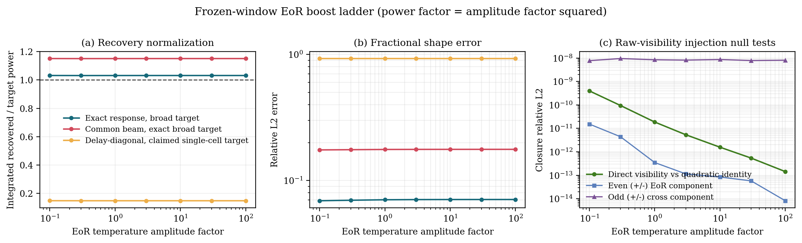

# `Q_beta` EoR 放大阶梯与正负注入闭合

## 1. 结论先行

本测试不支持“只有我们的方法成功”这一表述。Gorce et al. 的工作已经用 HERA
exact cylindrical window functions 恢复过 EoR-only 验证信号；Aguirre et al. 的
HERA 端到端验证也恢复了特意放大到约 `25 sigma` 检测显著度的输入信号。当前工作的
可辩护区别是：在本 OSKAR/SKA-like controlled simulation 中，把精确
station-pair complex Jones response、全频 DPSS 和 quadratic estimator 一起传播为
可审计的 broad cylindrical sky-band windows，而不是“首次成功恢复 EoR 功率谱”。

本轮温度振幅 `0.1--100` 倍、即功率 `0.01--10000` 倍的同数据阶梯表明：

1. exact station-pair 结果始终保持在约 `1.031/0.071` 的 integrated ratio/L2；
2. common scalar beam 始终保持约 `1.151/0.177`，不会因为 EoR 变亮而恢复正确；
3. delay-diagonal 若按其声称的 single-cell target 解释，始终只有约
   `0.148/0.928`，同样不会被高信号修复；
4. raw-visibility 正负注入和二次型恒等式闭合到 `9.51e-9` 或更好，把本链条中
   常见的幅度平方、相加位置、符号、重复 operator 和 combined-product 错误限制在
   远低于科学误差的水平。

因此，未放大的成功不是信号太弱时偶然选出的结果；两条简化线的失败也是结构性
response/estimand 问题，而不是信噪比问题。

## 2. 与文献放大信号的可比性

Aguirre et al. (2022) 把一个 `P(k) proportional to k^-2` 的 Gaussian random
field 调到在 `k approximately 0.2 h Mpc^-1` 约 `25 sigma`，目的是让 foreground、
EoR、systematics 和 thermal-noise 主导区间都能在端到端测试中出现。论文没有给出一个
可以无条件套到任意物理 EoR cube 上的统一“温度倍数”；`25 sigma` 依赖其噪声、积分
时长、阵列和 binning。Gorce et al. (2023) 使用这套 HERA validation simulations，
并报告 exact-window 修正后 EoR-only 输入在 `k > 0.04 Mpc^-1` 的大部分模式达到
约 5% 精度；其文中也指出 50 个 realizations 的平均可把 aliasing correction 精度
推进到 1% 以内。

本轮无热噪声，不能把振幅倍数直接换算成 HERA 的检测 sigma。因此明确报告两个量：

- `amplitude_factor = a`：乘在 EoR brightness temperature 和 visibility 上；
- `power_factor = a^2`：对应输入 EoR power 的倍数。

阶梯使用 `a = 0.1, 0.3, 1, 3, 10, 30, 100`，覆盖 `0.01--10000` 倍功率，比只选
一个“容易检测”的高幅值更适合检查线性、cross term 和归一化。

## 3. 冻结测试契约

三条 operator 线复用上一轮完全相同的 `local_04` 数据：64 个输入频率、中央 32 个
分析频率、1536 条 rows、同一 FG/EoR visibility bank、DPSS/Hann 设置、response
probes 和 coarse profiles。所有 response-only support masks 在查看放大阶梯前冻结；
任何倍数都不会重新选择小格点。

对线性 filter 后的二次统计，令前景 visibility 为 `F`、EoR 为 `E`，必须有

```text
q(F + a E) = q(F) + a [q(F + E) - q(F) - q(E)] + a^2 q(E).
```

方括号是单位振幅下的 FG-EoR cross term。主阶梯直接按该完整二次式构造，不会错误地
把 FG+EoR power 当作两项简单相加。作为独立数据路径检查，本轮又从原始 complex
visibility bank 对所有倍数重新执行 DPSS、Hann delay transform、绝对 delay folding
和 row averaging，再与上述代数结果比较。

进一步使用正负注入：

```text
0.5 [q(F + aE) + q(F - aE)] - q(F) = a^2 q(E)
[q(F + aE) - q(F - aE)] / (2a) = q_cross(a=1).
```

第一式消掉 cross term，第二式消掉纯 FG 和纯 EoR 项。这两个 null tests 对符号、平方
和相加位置错误很敏感。

## 4. `4x1` 主结果

下表中 exact/common 统一评价 exact broad-window target；delay 列评价其自身声称的
single-cell target。`ratio/L2` 分别为 mode-weighted integrated power ratio 和
relative L2。

| EoR 温度倍数 | EoR 功率倍数 | exact broad | common beam vs exact broad | delay native single-cell |
|---:|---:|---:|---:|---:|
| `0.1` | `0.01` | `1.03137/0.06910` | `1.15085/0.17491` | `0.14854/0.92828` |
| `1` | `1` | `1.03112/0.07035` | `1.15058/0.17632` | `0.14825/0.92824` |
| `10` | `100` | `1.03123/0.07064` | `1.15070/0.17667` | `0.14825/0.92824` |
| `100` | `10000` | `1.03124/0.07067` | `1.15072/0.17670` | `0.14825/0.92824` |

exact 的纯 EoR 极限为 `1.031240/0.070678`。同一个 realization 只做幅度缩放不会降低
其 fractional sample variance，所以放大后不会自动趋近 `1/0`。FG+cross 相对 exact
target 的 L2 从 `a=0.1` 时的 `3.94e-3`，降到 `a=1` 的 `4.00e-4`、`a=10` 的
`4.13e-5` 和 `a=100` 的 `4.14e-6`，符合 cross term 主要按 `1/a` 衰减的预期。

common beam 在 `a=100` 时 FG+cross 已只有 `4.63e-6` L2，但 integrated ratio 仍为
`1.15072`，直接确认约 15% 偏差属于 response normalization。delay 线若改用 exact
broad target 看起来会与 exact 接近，因为它保留了 exact row sums 和同一 observed
`q`；但其 native single-cell target 始终失败，这正是 estimand 解释错误。



## 5. 原始 visibility 与正负注入闭合

- 保存的 FG、EoR 和 total `q` 对 raw-visibility 重算的 relative L2 分别为
  `4.10e-9`、`2.62e-16` 和 `1.87e-11`；
- 所有正向倍数的 direct visibility 与完整二次型公式最坏 relative L2 为
  `3.97e-10`；包含 `a=0` 的 foreground-only control 后最坏为 `4.10e-9`；
- 正负注入偶数 EoR 分量最坏 relative L2 为 `1.52e-11`；
- 正负注入奇数 cross 分量最坏 relative L2 为 `9.50e-9`。

奇数项的误差略大是因为它由两个很大的正负注入 power 相减得到一个很小的 cross
term；`1e-8` 仍远低于任何科学指标阈值。复核时曾发现旧摘要的 foreground 单项
closure 错把排序后第一个 `-100` 注入当成 `a=0`；该索引只影响这一展示字段，不参与
主阶梯或 parity 指标。现已改成按 factor 显式查找，并加入“零倍数不在首位”的回归
测试；本节数值均来自修复后对 1536 条原始 visibility 的重新计算。

## 6. 可支持和不可支持的论文表述

可以支持：

- 在当前无噪声 OSKAR aperture-array controlled simulation 中，未放大的物理 EoR
  已能按冻结的 exact broad windows 恢复；
- 恢复对四个数量级的输入功率缩放保持线性，raw visibility 和正负注入闭合；
- common-beam normalization 与 delay-diagonal estimand 错误不会被高 EoR 幅值掩盖。

不能支持：

- “只有我们的方法能够恢复 EoR”；
- “本工作首次使用 exact window functions 恢复 EoR”；
- 把无噪声的 `100x` 温度倍数换算成 HERA 的 `25 sigma`；
- 由本轮闭合推断真实数据中的 PB、校准、RFI、热噪声或电离层误差已经解决。
- 把本轮称为完全独立的软件复现：raw-visibility 路径绕过了保存的 `q` 和放大代数，
  但仍复用正式管线的 DPSS/quadratic 实现，因此不能排除两条路径共享的底层错误。

更准确的创新定位应是：把已有 exact-window/quadratic-estimator 思想推进到当前
station-pair complex aperture-array response，并对 broad cylindrical estimand、
common-beam 简化和 delay-diagonal 简化做同数据可审计验证。

## 7. 产物与来源

- evaluator：`ops_scripts/evaluate_visibility_qbeta_eor_boost_ladder.py`
- plot：`ops_scripts/plot_visibility_qbeta_eor_boost_ladder.py`
- machine summary：
  `docs/results/visibility_qbeta_eor_boost_ladder_20260817/summary.json`
- remote run：
  `/data1/zhenghao/fg_rmw/runs/visibility_qbeta_eor_boost_ladder_20260817`
- Aguirre et al. (2022): <https://arxiv.org/abs/2104.09547>
- Gorce et al. (2023): <https://doi.org/10.1093/mnras/stad090>
