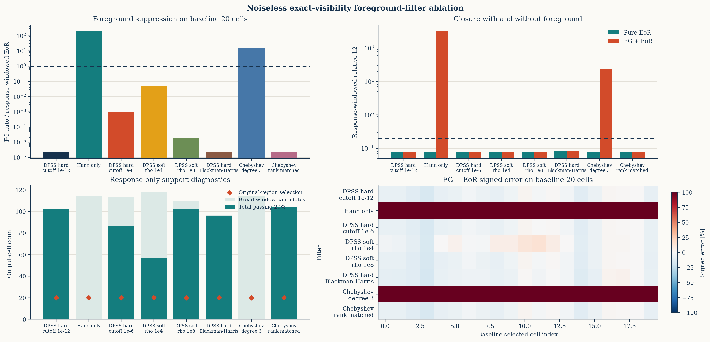
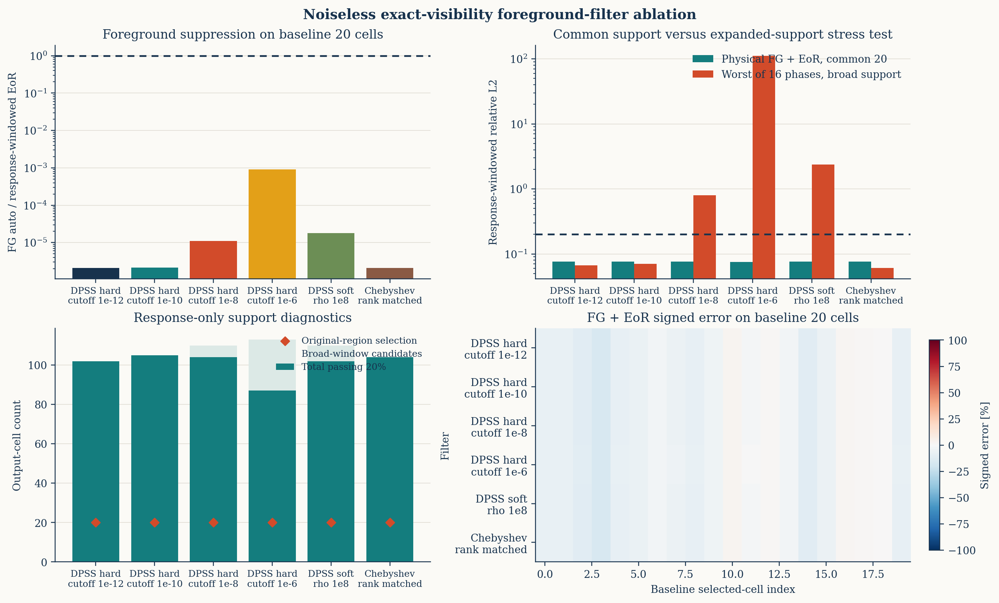

# Visibility-domain `Q_beta` 前景滤波消融

## 1. 问题与结论

当前 visibility-domain 结果的主要前景压制确实来自频率轴上的低-delay
子空间投影；默认实现使用 DPSS hard projection。DPSS 本身不是本项目的新
算法。最接近的已有方法是
[DAYENU](https://arxiv.org/abs/2004.11397)，它已经用 DPSS 表示有限
delay 区间内的平滑前景，并将其写成近似逆协方差滤波。

本项目相对 DAYENU 的具体实现差异是：将天空圆柱功率带通过逐
baseline-time 的 exact no-PB DFT、chromatic baseline migration、`w` 项、
100 kHz channel averaging、10 s time averaging、前景滤波和二次估计器，
显式标定完整的 `Q_beta` 响应。最终比较的是

```text
P_hat[alpha] = q[alpha] / sum_beta R[alpha,beta]
P_target[alpha] = sum_beta W[alpha,beta] p[beta],
W[alpha,beta] = R[alpha,beta] / sum_beta R[alpha,beta],
```

而不是把滤波后的 delay bin 直接解释为一个未混合天空格点。

因此目前能成立的“提高”是 **对 exact operator 下二维天空 bandpower
window、signal loss 和 source-context mixing 的显式传播与逐格闭合**，
不是“DPSS 比已有论文更好”。DAYENU 在宽带预过滤、RFI flags、缺失频点、
有限逆协方差和更真实观测条件上仍明显更完整；本轮仍是无噪声、无 PB、
固定 rows 的受控测试。

## 2. 默认滤波器

对每个 `k_perp` bin，以有限天空 patch 的角尺度和冻结 wedge buffer
构造最大 delay：

```text
tau_max(k_perp)
  = u_upper(k_perp) sin(theta_corner) / nu_ref
  + Y Delta-k_buffer / (2 pi).
```

在 20 个原 reporting windows 对应的 `k_perp` bins 中，
`tau_max=0.477--0.803 us`。默认 `1e-12` eigenvalue cutoff 保留
11--14 个 DPSS directions。令这些正交方向为 `U`，则默认分析矩阵为

```text
P_fg = I - U U^H
A = F_delay^H T_Hann P_fg
q_alpha = mean_rows |A v|^2 / row_normalization.
```

`Q_beta` 再用 544 个随机相位单位天空带标定 `A` 之后的完整响应。
这一步包含 radial Nyquist 输入 context；当前 `112x544` 响应不作欠定的
逐 source-bin 反演。

与此对应，本轮新增：

- Hann-only：完全不投影前景；
- soft-DPSS：使用有限强度
  `I-U diag(rho lambda/(1+rho lambda)) U^H`；
- DPSS cutoff `1e-10/1e-8/1e-6`；
- DPSS hard projection 后改用 Blackman-Harris taper；
- 三阶 Chebyshev hard projection；
- 与 DPSS rank 相同的高阶 Chebyshev hard projection。

全部方案使用相同 exact operator、4 个不重叠 partition、每 partition
96 rows/bin、相同 544-source context 和相同 probe seeds。

## 3. 第一阶段筛选

表中 `FG/EoR`、L2 都在默认 DPSS 的原 20 个公共 windows 上计算；每种
滤波器都与自己的 response-windowed `W p` 比较。`broad pass` 是响应至少
95% 留在完整几何 EoR window、相对响应至少 0.1 的事后诊断，不是原 20-window
主结果。

| 方法 | 公共 20 格 FG/EoR | total L2 | output support | broad pass/candidate |
|---|---:|---:|---:|---:|
| DPSS hard，cutoff `1e-12` | `2.074e-6` | `0.07634` | 112 | 102/102 |
| Hann-only | `2.038e2` | `3.215e2` | 135 | 0/114 |
| DPSS hard，cutoff `1e-6` | `9.078e-4` | `0.07501` | 123 | 87/113 |
| DPSS soft，`rho=1e4` | `4.593e-2` | `0.07496` | 128 | 57/118 |
| DPSS soft，`rho=1e8` | `1.783e-5` | `0.07620` | 120 | 102/110 |
| DPSS hard + Blackman-Harris | `2.096e-6` | `0.08194` | 112 | 96/97 |
| Chebyshev degree 3 | `1.583e1` | `2.408e1` | 135 | 0/114 |
| Chebyshev，DPSS-rank matched | `2.075e-6` | `0.07634` | 114 | 104/104 |

由此得到：

1. Hann-only 和三阶多项式明确失败。复杂 chromatic visibility 前景不能由
   当前 3.2 MHz 内的低阶谱多项式充分压制。
2. Blackman-Harris 没有降低残余前景，反而把原 20 格 window effective
   width 的中位数从 `3.851` 扩到 `4.627`，并使 L2 变差。
3. soft-DPSS `rho=1e4` 的单个 total realization 看似接近 unity，实际仍有
   约 5% 的 FG-EoR cross contribution，属于偶然抵消，不是改进。
4. 等秩 Chebyshev 可以复现 DPSS，但它在相关 bins 使用 11--14 个多项式
   directions，并不是通常意义的低阶 foreground polynomial。

等秩 Chebyshev 与 DPSS 的 canonical-correlation 诊断也支持最后一点：
在原 10 个 `k_perp` bins 中，最小 canonical correlation 为
`0.972--0.993`，最大 principal angle 只有 `6.66--13.60 deg`。它几乎表示
同一个离散平滑子空间，因此这个结果说明“基底表示不是唯一的”，而不是
“低阶 power law 已经足够”。



## 4. 16 相位 promotion

为避免把 FG-EoR cross term 的偶然符号当成成功，对六个候选固定同一前景，
重新生成 16 个 held-out EoR phases，并同时计算 pure-EoR 与 FG+EoR。
校准响应、rows 和 source context 不变。

| 方法 | 原 reporting-bin rank | broad candidate | bank total pass | 16 相位最少 pass | 最坏 broad L2 | 最坏单格误差 |
|---|---:|---:|---:|---:|---:|---:|
| DPSS hard `1e-12` | 11--14 | 102 | 102 | 101 | `0.0663` | `20.13%` |
| DPSS hard `1e-10` | 10--13 | 105 | 105 | 104 | `0.0706` | `20.09%` |
| DPSS hard `1e-8` | 9--12 | 110 | 104 | 102 | `0.793` | `318.9%` |
| DPSS hard `1e-6` | 8--10 | 113 | 87 | 86 | `111.5` | `3.02e4%` |
| DPSS soft `rho=1e8` | 11--14 | 110 | 102 | 100 | `2.364` | `628.6%` |
| Chebyshev rank matched | 11--14 | 104 | 104 | 103 | `0.0606` | `20.14%` |

每种方法少通过的一格都是先前已经记录的同一个约 20.1% response-calibration
擦边点；不能通过放宽阈值删除。真正的区分来自新增低-`k_parallel` cells：

- cutoff `1e-10` 比 `1e-12` 新增 3 格，均位于
  `k_parallel=0.4063 Mpc^-1`、`k_perp=0.4382/0.4875/0.5368 Mpc^-1`；
  16 相位最坏 total 误差分别为 `7.48/19.76/17.55%`，前景造成的最坏变化
  为 `3.42/0.65/5.15%`。
- 等秩 Chebyshev 新增其中前 2 格；最坏 total 误差为 `9.86/14.28%`，
  前景造成的最坏变化仅 `0.025/0.065%`。
- cutoff `1e-8/1e-6` 和 soft-DPSS 的新增窗口虽然满足 response localization，
  但被残余前景严重污染，不能 promotion。

因此本轮最稳妥的工程结论是：

- 原 `1e-12` hard-DPSS 仍是默认保守方案；
- `1e-10` hard-DPSS 是一个小幅扩大无噪声支持的候选，但只增加 3 格，
  尚不能替代独立 time/sky split 和噪声 cross-power 验证；
- 等秩 Chebyshev 是有效的算法对照，且新增 2 格更干净，但由于它与 DPSS
  子空间高度重合，不构成新的前景物理先验或独立分离机制；
- 不应根据公共 20 格的良好结果，把 `1e-8/1e-6` 或 soft-DPSS 的全部
  response support 宣称为可恢复区域。



## 5. 与已有 DPSS 工作的边界

[DAYENU](https://academic.oup.com/mnras/article/500/4/5195/5936652)
已经证明 DPSS 是有限 delay 区间的最优集中基，并实现了有限近似逆协方差、
DAYENUREST、flagged-channel 处理，以及先在约 60--100 MHz 上过滤、再截取
约 10 MHz 作功率谱的 wideband strategy。后者能显著减小滤波边缘外的
signal attenuation。当前 3.2 MHz hard-projector 不能声称优于这些结果。

[Kern & Liu 2021](https://arxiv.org/abs/2010.15892) 强调 GPR/线性前景
滤波会扭曲 power-spectrum window，若归一化不正确会产生 signal loss。
本项目的 `544 -> 112` exact `Q_beta` 与 `W p` 闭合正是针对这类问题，但
目前只在受控 no-PB operator 下验证。

其他使用 DPSS 的工作目标也不同：

- [HERA inpainting residual study](https://arxiv.org/abs/2210.14927)
  主要比较 RFI 缺失频点的重建误差；
- [HERA fringe-rate filtering study](https://arxiv.org/abs/2402.08659)
  在时间/fringe-rate 维使用 DPSS。

当前可陈述的具体差异是：**对 exact no-PB baseline-time operator 后的
非对角天空 PS2D 响应进行全 source-context 标定和逐格闭合**。不能把它
扩大成“首次使用 DPSS”“首次考虑阵列”或“总体优于 DAYENU/HERA pipeline”。

## 6. 后续建议

在继续加噪声前，最有价值但尚未实现的是 DAYENU 推荐的 wideband
pre-filtering：用正确的 64-frequency exact visibility operator 先过滤，
再在内部稳定子带估计 PS2D。现有 64-frequency truth cube 不能代替这个
visibility operator，因此本轮没有用简化拼接冒充测试。

若进入噪声阶段，应固定 `1e-12` 基线和 `1e-10` 候选，构造独立
time/noise splits，并改用 cross quadratic estimator。窗口选择必须继续
只读 response；不能根据 noisy EoR truth 再删除失败格。

## 7. 可复现入口

- 核心滤波器：`chips_visibility.py`
- exact evaluator：`ops_scripts/calibrate_visibility_qbeta_noiseless.py`
- partition combiner：`ops_scripts/combine_visibility_qbeta_row_partitions.py`
- 消融调度：`ops_scripts/run_visibility_qbeta_filter_ablation.sh`
- 比较与作图：`ops_scripts/compare_visibility_qbeta_filters.py`
- promotion summary：
  `docs/results/visibility_qbeta_filter_ablation_20260724/summary.json`
- promotion per-cell table：
  `docs/results/visibility_qbeta_filter_ablation_20260724/cell_errors.csv`
- screen summary：
  `docs/results/visibility_qbeta_filter_screen_20260724/summary.json`
- 远程 screen：
  `/data1/zhenghao/fg_rmw/runs/visibility_qbeta_filter_ablation_20260724/`
- 远程 promotion：
  `/data1/zhenghao/fg_rmw/runs/visibility_qbeta_filter_promotion_20260724/`
