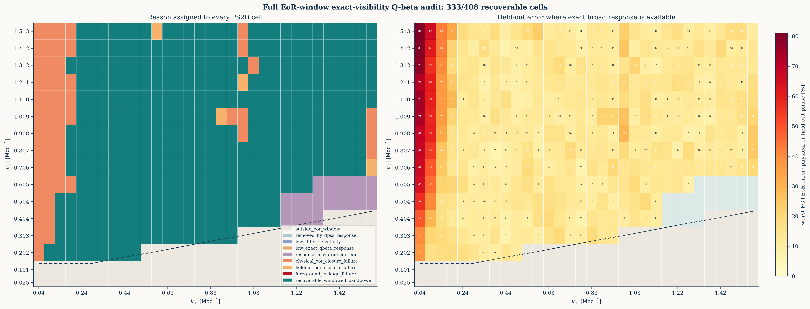

# 完整 EoR window 的 exact-visibility `Q_beta` 恢复测试

## 1. 结论

本轮确实把计算从原来只覆盖中等 `k_perp` 的 reporting 区扩展到了全部
32 个 `k_perp` bins，并强制计算了几何 EoR window 内全部 408 个二维格点。
测试使用 64 频 exact no-PB visibility operator、全带宽 hard-DPSS
预过滤、中央 32 频功率谱、240 rows/bin 和 16 个独立相位检验。

完整 408 格不能按当前严格定义全部恢复：

- 强制计算后，408/408 格都有数值输出；
- 389/408 格满足相对 `Q_beta` 响应不低于 0.1，且至少 95% 的响应权重
  留在几何 EoR window；
- 16 个随机相位中，每个相位有 387--389/389 个局域候选满足逐格误差
  `<20%`，积分功率比为 `0.9850--1.0320`；
- 原始物理 EoR realization 只有 337/389 个局域候选满足逐格门，
  响应加权积分功率比为 `0.7983`，L2 为 `0.3230`；
- 同时要求局域性、物理 EoR 和全部 16 个相位都通过时，最终为
  `333/408=81.62%`；
- 没有格点因前景泄漏失败。全部输出上的最坏前景影响为 `0.658%`。

因此现在的主要阻碍不是前景没有被压住，也不是 exact operator 不准，而是：

1. wedge 边缘附近的 hard-DPSS 投影与几何 EoR window 并不正交；
2. 当前 `Q_beta` 只标定 sky bandpower 的对角响应，而一个物理 EoR
   realization 经非正交色散 operator 后仍含不可忽略的跨 mode 相位交叉项；
3. 输出响应窗很宽，不能把通过的 333 格解释成 333 个独立 delta-bin。

## 2. 测试合同

| 项目 | 设置 |
|---|---|
| 输入频率 | `114.7--121.0 MHz`，64 频，间隔 `0.1 MHz` |
| 输出频率 | 中央 `116.3--119.4 MHz`，32 频 |
| 前景滤波 | 全 64 频 `1e-12` hard-DPSS，再截取中央 32 频 |
| operator | exact no-PB baseline-time DFT，含 `w`、时频平均和 chromatic migration |
| source context | 1056 个 in-range bands，含 radial-Nyquist 输入 |
| visibility rows | 20 个互斥 partitions，每份 12 rows/bin，共 240 rows/bin |
| 验证 | 原始物理 EoR bank、固定前景加 16 个独立随机相位 EoR |
| 逐格门 | 相对误差 `<20%` |
| 局域门 | relative response `>=0.1`；EoR-window response fraction `>=0.95` |

估计量仍是

```text
P_hat_alpha = q_alpha / sum_beta R_alpha,beta
W_alpha,beta = R_alpha,beta / sum_gamma R_alpha,gamma
```

比较目标是 `sum_beta W_alpha,beta P_beta`，不是 nominal `(k_perp,
k_parallel)` 小格中的未混合真值。

## 3. 两种输出支持定义

### 3.1 保守默认

默认先要求 DPSS delay response 的 matching fraction `>=0.1`，且相对滤波
灵敏度 `>=1e-4`。该口径得到：

| 类别 | 格点数 |
|---|---:|
| 几何 EoR window | 408 |
| DPSS 支持 | 368 |
| exact broad/localized candidates | 361 |
| DPSS response 预删 | 40 |
| 响应跨出 EoR window | 7 |
| 物理 EoR 闭合失败 | 51 |
| 额外 heldout 相位失败 | 4 |
| 严格恢复 | `306/408=75.00%` |

### 3.2 强制完整窗口

为判断 40 格是否只是被诊断阈值过早删除，另将上述两个预删阈值都设为
0，显式计算 408 格：

| 类别 | 格点数 |
|---|---:|
| 数值计算输出 | 408 |
| exact broad/localized candidates | 389 |
| 响应跨出 EoR window | 19 |
| 物理 EoR 闭合失败 | 52 |
| 额外 heldout 相位失败 | 4 |
| 严格恢复 | `333/408=81.62%` |

强制口径比保守口径增加 27 个严格通过窗口，但不能得到 408/408。
19 个越界窗口仍有响应，其窗口内权重为约 `89.32%--94.99%`；它们未通过
95% 局域门，而不是数值上严格为零。

如果完全忽略局域性，仅问每个输出能否逼近自己的 exact `W P`，16 个相位
中每相位有 406--408/408 格通过，全部相位交集为 400/408。再加入原始物理
EoR realization 后，交集降为 349/408。这一口径不能称为完整 EoR-window
恢复，因为部分 `W` 明确跨到窗口外。

## 4. 为何物理 EoR 与随机相位结果不同

随机相位 probe 标定的是 bandpower 对角响应

```text
R_alpha,beta = E[q_alpha | P_beta = 1].
```

对独立随机相位，`beta != gamma` 的二次交叉项在期望中消失。因此 16 个
heldout 相位的积分功率比稳定在 `0.9850--1.0320`，最坏响应加权 L2 为
`12.85%`。

原始物理 EoR cube 不是一次新的相位随机化。exact operator、DPSS 和二次
估计器使不同天空 modes 的响应不正交，所以单次 realization 中仍有

```text
x_beta^* E_alpha x_gamma,  beta != gamma
```

交叉项。当前 `R_alpha,beta` 没有把它们编码为可预测的 bandpower transfer。
这不是增加 calibration probe 数就能消除的偏差：rows/bin 从 48 增到 240
时，物理 EoR 的积分比仍为 `0.802 -> 0.798`，没有向 1 收敛。

52 个物理闭合失败格中有 43 个位于最低四个 `k_perp` bins：

```text
kperp index 0/1/2/3: 14/13/10/6 failures
```

这些 bins 的横向 Fourier mode 数最少，因此非对角交叉项和 sample
variance 最难通过细分 bin 平均掉。另有少量失败位于稀疏采样的最高
`k_perp` 边缘。

## 5. 为何通过格点也不是独立小格恢复

强制口径 389 个局域候选的 nominal same-cell response fraction 为：

```text
min / p25 / median / p75 / max
0.00063 / 0.1200 / 0.1697 / 0.2447 / 0.4046
```

响应窗 effective width 为：

```text
2.78 / 6.23 / 9.12 / 12.88 / 19.92 source bands
```

所以典型输出只有约 17% 权重落在 nominal matching source cell，并混合约
9 个 source bands。完整 1056-source 到 408-output 的反卷积本身欠定；
exact operator 只能准确告诉我们混合窗是什么，不能在无额外先验时把它变成
408 个独立 delta functions。

## 6. 当前主要阻碍的排序

1. **bandpower-only response 对物理 realization 不闭合。** 物理 EoR
   broad-support 积分比 `0.798`、L2 `0.323`，是当前最大的定量问题。
2. **wedge 边缘与 DPSS nuisance subspace 重叠。** 19 格无法满足 95%
   窗口内响应；放松 hard projection 会重新引入前景，之前的
   `1e-8/1e-6` cutoff 消融已经验证这一代价。
3. **响应窗宽且高度重叠。** 通过格只能解释为 windowed bandpowers。
4. **有限行数造成少量 heldout 尾部失败。** 240 rows/bin 后只剩 4 个
   非物理-realization独有的失败，不是主瓶颈。
5. **前景不是当前瓶颈。** 最坏前景影响 `0.658%`，严格分类中没有
   foreground-leakage failure。

## 7. 若继续追求更完整窗口

不引入强天空模板先验时，优先级应是：

1. 合并最低几个 `k_perp` bins，并对靠 wedge 的径向 bins 做响应感知合并，
   直接估计较粗、协方差可控的 bandpowers；
2. 把完整 window covariance 和非对角 mode-coupling 纳入 quadratic
   likelihood，而不是只使用 `R_alpha,beta` 的 bandpower 对角期望；
3. 用多个独立天空 patch 或更大视场平均物理-realization交叉项；
4. 对 19 个边界窗比较 90%/95% 局域门，但必须同步报告窗口外权重，不能
   把门限放松冒充独立 EoR-window 恢复；
5. 在上述无噪声闭合后，再加入独立 time/noise split、cross-power 和 beam。

若目标坚持为当前 408 个独立细格，而不是响应窗或较粗 bandpowers，则仅靠
更精确的 forward operator 和频谱平滑前景先验不够，需要额外的天空协方差
结构或正则化；这会改变当前“弱先验功率谱估计”的科学合同。

## 8. 可复现文件

- 调度器：`ops_scripts/run_visibility_qbeta_wideband_full_window.sh`
  （强制高统计使用 `PROFILE=forced_promotion`）
- 分区运行器：`ops_scripts/run_visibility_qbeta_row_partitions.sh`
- 逐格审计：`ops_scripts/analyze_visibility_qbeta_full_window.py`
- 强制高统计摘要：
  `docs/results/visibility_qbeta_full_window_forced_promotion_20260725/summary.json`
- 强制高统计逐格表：
  `docs/results/visibility_qbeta_full_window_forced_promotion_20260725/cell_audit.csv`
- 强制 48 rows/bin 筛查摘要：
  `docs/results/visibility_qbeta_full_window_forced_screen_20260725/summary.json`
- 保守高统计摘要：
  `docs/results/visibility_qbeta_full_window_promotion_20260725/summary.json`
- 完整二维图：
  `docs/figures/visibility_qbeta_full_window_20260725.png`
- 远端强制高统计 run：
  `/data1/zhenghao/fg_rmw/runs/visibility_qbeta_wideband_fullwindow_forced_promotion_20260725/`


