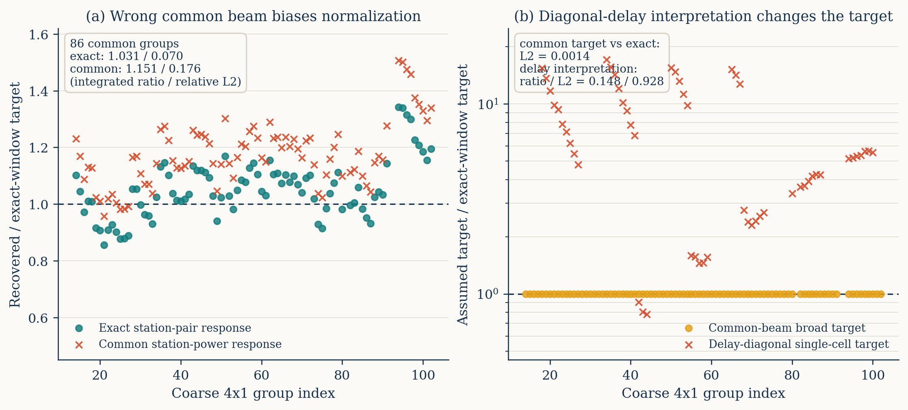

# `Q_beta` operator hierarchy 同数据对照

## 1. 目的与冻结数据

本轮回答两个相互独立的问题：

1. 是否可以用所有 baseline 共用的标量 station power beam 代替精确的
   station-pair complex Jones coherency；
2. 是否可以把经过 DPSS 和色散 operator 后的 broad response window 继续解释为
   一个名义上的单格 delay bandpower。

三条线使用完全相同的无噪声 OSKAR aperture-array visibility bank、EoR/FG sky、
`114.7--121.0 MHz` 的 64 个输入频率、中央 `116.3--119.4 MHz` 的 32 个分析频率、
DPSS/Hann 设置、row seed 和四个互斥 partitions。每个 partition 在每个
`k_perp` bin 使用 12 rows，合并后共 1536 rows。精确线直接复用
`local_04_116p3_119p4mhz` 的已有结果，没有重新计算。

## 2. 三条 operator 线

### 2.1 Exact station-pair

基准线缓存 OSKAR 对每个 station、时间、频率和 sky direction 的 Jones matrix，
并使用

```text
0.5 * trace(J_p J_q^H)
```

构造每条 baseline 的复数 Stokes-I coherency。完整链条包含精确 DFT、`w` term、
有限 channel bandwidth、有限 time averaging、全频 DPSS、子带 Hann delay transform
和 Monte Carlo sky-band response。

### 2.2 Common scalar station power

对每个频率用 OSKAR beam-pattern 计算 station 0 的 time-dependent Stokes-I
auto-power，并把同一个实数 beam 应用于所有 baseline。其余 DFT、色散、smearing、
DPSS、row 和 probe 均与精确线一致。这条线保留完整 chromatic baseline migration，
但有意丢弃 station-pair dependence 和复数 coherency；它是最接近常见
common-beam response 模型的受控近似，而不是对某篇文章实现的逐代码复现。

### 2.3 Favorable delay-diagonal

从精确 response 的每一行出发，保留该行的精确总增益，但把全部权重压到具有相同
band ID 的名义 source cell。这样不会额外引入标量归一化误差，对局部平坦谱也最
有利。该线测试的是“把 broad window 当作单格 intrinsic power”的解释，不是一个
新的 visibility forward simulator。

## 3. 工程实现和验证

- 主 evaluator 新增互斥参数
  `--aperture-common-beam-cache-pattern`，默认 exact station-pair 路径不变。
- common cache 严格检查 schema、SHA256、频率、station ID、time/source shape、OSM
  SHA256、phase centre、观测时长和时间步数。
- evaluator 输出和 partition combiner 明确记录
  `aperture_beam_implementation=common_scalar_power`，不会误标为 exact。
- delay-diagonal control、三臂 common-support comparison 和绘图均有独立脚本。
- 新增和相关回归测试中，纯 `pytest` 组合共 10 项通过；另在含 `torch` 的环境中
  逐项执行 `test_visibility_primary_beam.py` 的 9 个测试函数，全部通过。Python 编译
  和 Bash 语法检查也通过；两组测试分开运行是因为本机没有同时包含 `pytest` 与
  `torch` 的现成环境。

远端四张 A800 并行运行。64 个 common-beam caches 约 4 分钟完成；四分区 evaluator
分别耗时 `1892.6/1800.5/1785.2/850.5 s`，总 wall time 约 41 分钟。前三个进程同时
构建约 50-GiB 级 CPU-streamed operator 时受主机内存带宽限制，但没有 OOM、错误或
不完整产物。

## 4. 结果

### 4.1 Visibility closure 和 response 机制

| operator | combined visibility relative L2 | 说明 |
|---|---:|---|
| exact station-pair | `1.050e-6` | 数值闭合 |
| common scalar power | `9.371e-2` | 不能由公共 station power 复现 |
| delay-diagonal | N/A | 解释层 control，不生成 visibility |

common 与 exact 使用相同的 1536 rows，且 `bank_foreground_q`、`bank_eor_q` 和
`bank_total_q` 三个观测量逐位相同。差异只来自 response calibration：

- common/exact response row-sum ratio 为 `0.8831--0.9167`，中位数 `0.8966`；
- 完整 response matrix 的 relative L2 为 `0.09536`；
- 逐行归一化后的 window matrix relative L2 降为 `0.02190`；
- 在 exact/common 共同选中的 86 个 `4x1` groups 上，两条线定义的 broad
  scientific target 仅相差 `0.00143` relative L2。

因此 common-beam 的主要问题不是 coarse EoR target 形状，而是约 10% 的 response
增益错误，经过 bandpower normalization 后形成约 15% 的功率高估。

### 4.2 同一 exact scientific target

下表使用 exact/common 两条线的 pairwise response-only 交集，并统一比较 exact
broad-window target。`ratio/L2` 分别是 mode-weighted integrated power ratio 和
relative L2。

| profile | common groups | exact ratio/L2 | common-beam ratio/L2 | target L2 |
|---|---:|---:|---:|---:|
| fine | 341 | `1.0312/0.1737` | `1.1512/0.2656` | `0.00122` |
| pair `k_perp` | 171 | `1.0313/0.1073` | `1.1511/0.2063` | `0.00088` |
| quad `k_perp` | 86 | `1.0311/0.0703` | `1.1506/0.1763` | `0.00143` |
| quad `k_perp`, pair `k_parallel` | 44 | `1.0317/0.0654` | `1.1513/0.1746` | `0.00141` |

在 common 自己选中的 88 个 `4x1` groups 上，foreground effect maximum 仍只有
`7.88e-4`。因此 `15.19%` 的 integrated ratio 不是 foreground leakage，而是错误
beam response 的归一化偏差。

### 4.3 Delay-diagonal 的解释失败

delay control 使用与 exact 完全相同的 observed `q` 和 response row sums，所以若仍
以 exact broad-window target 评价，数值估计自然与 exact 一致。这不能支持 delay
解释；真正要检验的是它声称的 single-cell intrinsic target。

在 56 个 exact/delay 共同 `4x1` groups 上，single-cell target 的 mode-weighted
integrated power 是 exact broad target 的 `6.941` 倍，target relative L2 为
`8.458`。把同一个观测估计解释为该单格 target 后，恢复 ratio/L2 变为
`0.1483/0.9282`。其他 coarse profiles 也给出 `0.148--0.194` 的 ratio 和
`0.928--0.964` 的 L2。即使给予精确总增益，diagonal delay interpretation 仍不能
代表本 operator 后的科学 estimand。



## 5. 结论与边界

本轮给出两个直接结论：

1. 对当前 OSKAR aperture-array simulation，common station auto-power beam 不能
   替代 station-pair complex coherency；它既不能达到 visibility closure，也会把
   `4x1` bandpower integrated ratio 从 `1.031` 推到约 `1.151`。
2. 精确 operator 后的 response window 不能解释成单个 delay cell。忽略其非局域
   mixing 会改变被估计的科学量，而不仅仅是增加一个小误差条。

这加强了当前方法相对“DPSS 后直接读 delay bin”或“公共标量 beam response”的具体
区别：DPSS foreground suppression 本身不是创新，关键步骤是把精确 station-pair
operator 和 filter 一起传播成可审计的 broad sky-band window。

边界保持不变：本轮仍是无噪声、无校准误差/RFI/电离层、有限 sky patch 的 controlled
test；common-beam 结果不能外推成某个实际 pipeline 的最终误差预算。它只证明在当前
已冻结的 OSKAR 设置中，这两种简化不足以替代精确 response。

## 6. 产物

- 远端完整 run：
  `/data1/zhenghao/fg_rmw/runs/visibility_qbeta_operator_hierarchy_screen4_20260817`
- 本地摘要：
  `docs/results/visibility_qbeta_operator_hierarchy_20260817/`
- 主比较：`comparison_summary.json`
- 代码：
  `visibility_primary_beam.py`、
  `ops_scripts/calibrate_visibility_qbeta_noiseless.py`、
  `ops_scripts/build_visibility_qbeta_diagonal_response_control.py`、
  `ops_scripts/compare_visibility_qbeta_operator_hierarchy.py`、
  `ops_scripts/plot_visibility_qbeta_operator_hierarchy.py`、
  `ops_scripts/run_visibility_qbeta_operator_hierarchy_screen.sh`
