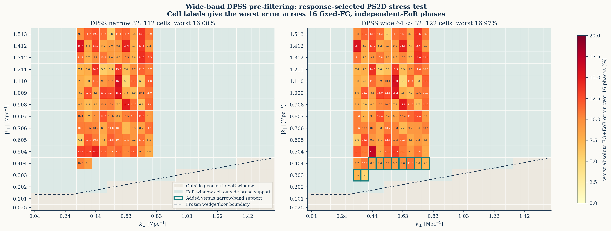
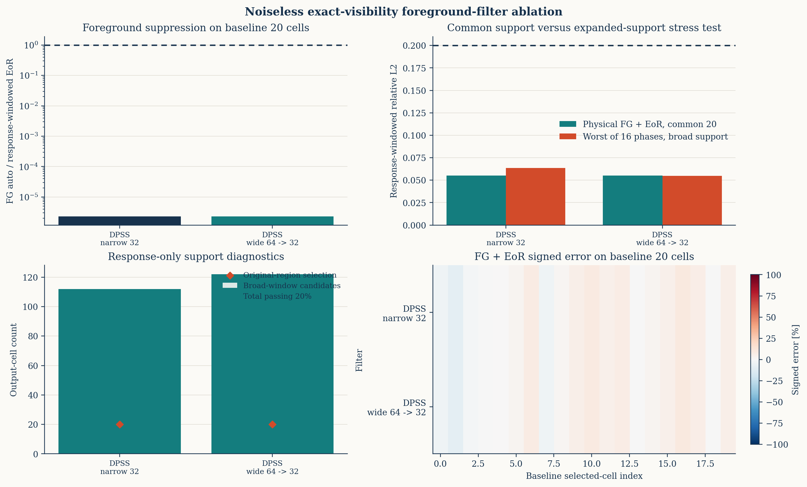

# 64 频宽带 DPSS 预过滤测试

## 1. 结论

在相同的无噪声 exact visibility operator、天空、baseline-time rows、
`Q_beta` source context 和随机种子下，把 DPSS 投影带宽从中央 32 频扩大到
完整 64 频、再截取中央 32 频估计二维功率谱，得到一个明确但有限的改善：

- broad response-localized support 从 `112` 增至 `122` 格，新增 `10` 格且
  没有丢失窄带格点；
- 固定同一前景、16 个独立 EoR 相位时，宽带的 `122/122` 格在每个相位中
  都满足单格误差 `<20%`；
- 宽带 broad-support 的最坏相位 L2 从窄带 `6.351%` 降至 `5.477%`；
- 公共 20 格上的前景自功率/目标仍为约 `2.3e-6`，没有用更大的前景残差
  换取 support；
- 10 个新增格的 16 相位最坏误差为 `5.30%--10.95%`，最坏前景影响为
  `0.162%`。

因此，宽带预过滤确实缓解了有限子带边缘造成的低
`k_parallel` signal-loss/support 损失。它没有改变原先预声明的 20 格主结果，
但把 response-only broad support 从完整 408 格几何 EoR window 的
`27.45%` 提高到 `29.90%`。这些是重叠的 windowed bandpowers，不是 122 个
独立反卷积天空格点。

## 2. 受控比较

完整输入为 `114.7--121.0 MHz`、间隔 `0.1 MHz` 的 64 个 channel。功率谱
分析固定在中央 `116.3--119.4 MHz` 的 32 个 channel，因而上下各有
`1.6 MHz` guard band。

窄带基线先取中央子带，再构造 32 频 DPSS projector：

```text
A_narrow = F_32^H T_Hann P_DPS S_center.
```

宽带方案先在完整 64 频上投影低-delay nuisance subspace，再取中央子带：

```text
A_wide = F_32^H T_Hann S_center P_DPS,64.
```

两者都使用 `1e-12` DPSS eigenvalue cutoff 和相同的逐
`k_perp` 最大 delay。原 reporting `k_perp` bins 中，窄带 projector rank
为 `11--14`，宽带为 `16--21`。rank 增加是带宽翻倍后的预期
time-bandwidth scaling，不是额外天空模板先验。

每条链都包含 no-PB direct DFT、真实天线 baseline-time 几何、chromatic
baseline migration、`w` 项、100 kHz channel averaging、10 s time
averaging、DPSS filter 和 quadratic estimator。64 频 exact operator
closure 为 `3.336e-6`。

测试使用 8 个互斥 row partitions，每份 48 rows/bin，合并为
384 rows/bin 和 3840 条唯一 rows。`Q_beta` 响应包含 1056 个
in-range source bands，包括 radial Nyquist 输入 context；窄带和宽带的
响应形状分别为 `112x1056` 和 `122x1056`。每份响应用 2 次 calibration
probe、1 次独立 validation probe，并使用 16 个固定前景、独立随机相位
EoR mixture。

## 3. 主要指标

`broad candidate` 完全由响应决定：

```text
relative Q_beta response >= 0.1
response weight inside geometric EoR window >= 0.95.
```

不使用 EoR 真值选择格点。估计量仍与各自的 response-windowed
`W P_EoR` 比较，而不是与未混合 delta-bin 真值比较。

| 指标 | 32 频窄带 DPSS | 64 频预过滤后取 32 频 |
|---|---:|---:|
| supported outputs | 112 | 122 |
| broad candidates | 112 | 122 |
| 相对窄带新增/丢失 | 0/0 | 10/0 |
| bank pure-EoR `<20%` | 112/112 | 122/122 |
| bank FG+EoR `<20%` | 112/112 | 122/122 |
| 16 相位最少通过数 | 112/112 | 122/122 |
| 16 相位最坏 broad L2 | 6.351% | 5.477% |
| 16 相位最坏单格误差 | 16.00% | 16.97% |
| broad 逐格最坏误差中位数 | 10.35% | 9.90% |
| broad 最大前景影响 | 0.588% | 0.162% |
| calibration/validation response L2 | 5.140% | 5.114% |
| 公共 20 格 FG auto/target | `2.287e-6` | `2.281e-6` |
| 公共 20 格 physical total L2 | 5.521% | 5.521% |

宽带最坏单格 `16.97%` 略高于窄带 `16.00%`，但它发生在已有 support 内；
新增 10 格本身都低于 `11%`。因此改善不是通过加入一批擦着 20% 门限的格点
得到的。

## 4. 新增格点

| `k_parallel` [Mpc^-1] | `k_perp` [Mpc^-1] | 16 相位最坏误差 | 最坏前景影响 |
|---:|---:|---:|---:|
| 0.3027 | 0.3385 | 7.50% | 0.113% |
| 0.3027 | 0.3877 | 5.30% | 0.148% |
| 0.4036 | 0.4368 | 8.47% | 0.056% |
| 0.4036 | 0.4859 | 8.96% | 0.017% |
| 0.4036 | 0.5351 | 9.89% | 0.162% |
| 0.4036 | 0.5842 | 9.01% | 0.045% |
| 0.4036 | 0.6334 | 9.62% | 0.057% |
| 0.4036 | 0.6825 | 10.95% | 0.015% |
| 0.4036 | 0.7316 | 8.05% | 0.034% |
| 0.4036 | 0.7808 | 7.27% | 0.040% |

宽带方案补齐了 reporting `k_perp` 区间内原来只保留 2 格的
`k_parallel=0.4036 Mpc^-1` 层，并在更低的 `0.3027 Mpc^-1` 层增加 2 格。
这正是 guard-band 预过滤预期最有帮助的滤波边缘区域。





## 5. 解释边界

这轮结果支持“宽带 DPSS 是当前无噪声链的工程改进”，但不能解释为实际
观测检测：

- 没有 thermal noise、primary beam、RFI flags 或 calibration error；
- 使用固定 baseline-time rows，没有 uv gridding；
- rows 只集中在预声明 reporting `k_perp` 范围；
- 16 个相位共享同一 foreground 和 EoR bandpower envelope，不是 16 个独立
  物理 reionization simulations；
- 122 个输出 window 的 effective width 中位数为 `7.50` 个 64 频 source
  bands，且相互重叠；
- 完整 1056-source 反演仍欠定；有效结果是 `q/sum_beta R` 对应的
  response-windowed bandpower。

窗口折叠实现随后统一为矩形输出/输入 delay 轴，并在删除 source Nyquist
后重归一化。修正前后窄带和宽带的 `window_self>=0.1` support mask 均完全
相同，因此本轮 10 格增益不依赖该诊断修正。

## 6. 后续

当前最合理的下一步不是继续扩大无噪声声明，而是冻结 122 格候选 support，
加入独立 time/noise splits 和 cross quadratic estimator。之后再测试 flags
和 station beam。宽带 `1e-10` cutoff 可以作为次级无噪声 coverage
消融，但不应优先于噪声交叉功率验证。

## 7. 可复现入口

- 64 频 visibility bank：
  `ops_scripts/run_chips_visibility_64freq_noiseless.sh`
- 宽带/窄带调度：
  `ops_scripts/run_visibility_qbeta_wideband_ablation.sh`
- exact evaluator：
  `ops_scripts/calibrate_visibility_qbeta_noiseless.py`
- 矩形 DPSS response：
  `chips_visibility.py`
- 比较、逐格 CSV 与作图：
  `ops_scripts/compare_visibility_qbeta_filters.py`
- 机器摘要：
  `docs/results/visibility_qbeta_wideband_20260725/summary.json`
- 全部 broad-support 逐格结果：
  `docs/results/visibility_qbeta_wideband_20260725/broad_cell_errors.csv`
- 64 频 bank SHA256：
  `9b97a62ba2ff495c4ba2d8e414929b6b6596d571dd70578ffcebafe86dd68694`
- 远程 promotion：
  `/data1/zhenghao/fg_rmw/runs/visibility_qbeta_wideband_promotion_20260725/`
